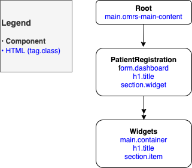

[](https://travis-ci.org/openmrs/openmrs-esm-patient-registration)

# Patient Registration ESM
Patient registration form micro-frontend for the OpenMRS SPA. It provides a configurable dashboard with configurable form fields (widgets) such as patient name, age, and address.

## Overview
The Patient Registration module is divided into 3 separate component types: Root, PatientRegistration, and Widgets. The diagram below describes the hierarchy of these components and their general HTML skeletal structure.



## Built With
- [React (TypeScript)](https://reactjs.org/) - front-end JS library
- [Jest](https://jestjs.io/) - JS testing framework
- [Enzyme](https://enzymejs.github.io/enzyme/) - JS testing utility for React components
- [npm](https://www.npmjs.com/) - Node package manager
- [webpack](https://webpack.js.org/) - JS module bundler
- [ESLint](https://eslint.org/) - JS linter
- [Prettier](https://prettier.io/) - code formatter
- [Babel](https://babeljs.io/) - JS compiler
- [Travis CI](https://travis-ci.org/) - CI environment

## Installation

### Prerequisites
- Node
- Git
- [openmrs-esm-patient-registration](https://github.com/openmrs/openmrs-esm-patient-registration)
- [openmrs-esm-root-config](https://github.com/openmrs/openmrs-esm-root-config)
- [OpenMRS SPA](https://openmrs-spa.org/openmrs/spa/login)

### Setup Patient Registration Module
1. Clone the [openmrs-esm-patient-registration](https://github.com/openmrs/openmrs-esm-patient-registration) repo
```
git clone https://github.com/openmrs/openmrs-esm-patient-registration.git
```
2. Install dependencies in the root directory of the repo
```
npm i
```
3. Run the module from `localhost:8080`
```
npm start -- --https
```

*Note: the module URL: [https://openmrs-spa.org/openmrs/spa/patient-registration](https://openmrs-spa.org/openmrs/spa/patient-registration).*

### Setup Dev Tools
1. Follow the dev tools steps in the [setup guide](https://wiki.openmrs.org/display/projects/Setup+local+development+environment+for+OpenMRS+SPA)
2. Click `Add new module` in the dev tools window
3. Type in the `Module Name:` `@openmrs/esm-patient-registration-app`
4. Type in the `Override URL:` `8080`
5. Go to the browser's development tools (e.g. via `Inspect`)
6. Go to the `Application` tab
7. Go to `Local Storage`
8. You should see a key called `import-map-override:@openmrs/esm-patient-registration-app`
9. Update the corresponding value to `//localhost:8080/openmrs-esm-patient-registration.js`
10. Refresh the page

*Note: Currently OpenMRS dev tools are not able to update the correct link.*

## Tests
To verify that all of the tests run:
```
npm test
```
*Note: Run `npm i` before running tests for the first time.*

*Note: These tests are for `openmrs-esm-patient-registration`.*

## Deployment
Currently, there are no releases for this module and it can only be locally deployed by following the installation instructions.

## Configuration
This module is designed to be driven by configuration files. These files define the look and functionality required to drive the Patient Registration module.

*Note: Currently, the module cannot be configured as it is in the early stages of development.*

### Widgets
A widget is simply a component that, in the case of the Patient Registration module, makes up the different fields required to register a patient. For example, the date of birth field is a widget. The widgets are designed to be configurable to enable the user to customise how they want their widget to look and function.

*Note: Currently, the widgets cannot be configured as they are in the early stages of development.*

## Resources
- [Wiki Documentation](https://wiki.openmrs.org/display/projects/openmrs-esm-patient-registration)
- [JIRA Ticket MF-191](https://issues.openmrs.org/browse/MF-191)

## Authors
- [Nick Hill](https://github.com/nickjhill14)
- [Lucas Kummer](https://github.com/trepolus)
- [Florian Rappl](https://github.com/FlorianRappl)

## Acknowledgements
- [Florian Rappl](https://github.com/FlorianRappl) - scaffolding and setting up the module as well as onboarding the dev team
- Romain Buisson - design, inception, and analysis
- Helena Lyhme - design, inception, and analysis
- Susanna Schiavi - design, inception, and analysis
- [openmrs-esm-home](https://github.com/openmrs/openmrs-esm-home) - reference code for setting up and beginning development of the module

## License
The project is licensed under the MIT License - see the [LICENSE.md](./LICENSE.md) file for details.
